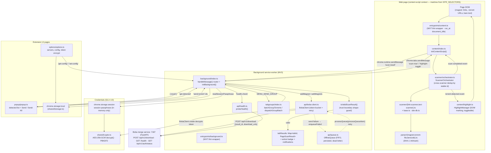

# BobaLink Browser Extension — Architecture

**Revision:** 1
**Last modified:** 2026-06-10T23:55:00Z
**Scope:** BobaLink (`extension/`) — WXT + TypeScript Manifest-V3 cross-browser
extension that detects magnet links and `.torrent` URLs on supported pages and
forwards them to the Boba merge service on port 7187.
**Authority:** the real source tree under `extension/src/`;
`docs/browser_extension/Status.md` (Rev 7).

> **Anti-bluff (§11.4.6).** Every component, edge, and message type below traces
> to a real module under `extension/src/` (verified by reading the source). No
> invented components. Where a name is load-bearing it is given exactly as it
> appears in the code (`isValidScanResult`, `MENU_SEND_GROUP`, `addMagnets`,
> `readSessionPassphrase`, `POST /api/v1/download`, …).

---

## 1. Data-flow diagram

The diagram renders on GitHub. In the exported HTML it remains a fenced code
block (per scope note) — the textual edges are the load-bearing record.

**Edge legend.** Solid = primary request/response path; dotted = failure/retry
path. Quoted labels are real `MessageType` strings or method names from the code.

### Narrative trace (page → backend)

1. **Page DOM → content script.** The WXT content entrypoint
   (`entrypoints/content.ts`, `run_at: document_idle`, `matches` derived from
   `SITE_SELECTORS`) calls `initContentScript()` (`content/index.ts`), which
   builds a `ScannerOrchestrator`.
2. **Orchestrator → scanners → parsers.** The orchestrator runs `LinkScanner` +
   `TextScanner` over the DOM, deduping by the `base.ts` stable id; the parsers
   (`magnet.ts`, `torrent-file.ts`, `bencode.ts`) extract the SHA-1 infohash. On
   each `scan-completed` event the content script sends a typed `scan-result`
   envelope up via `chrome.runtime.sendMessage`. The `HighlightManager` marks
   detected links in the DOM (toggleable).
3. **Background router.** `background/index.ts` `handleMessage()` receives
   `scan-result`, passes it through `isValidScanResult()` (the trust-boundary
   shape-guard — a non-array `items` is rejected so a hostile page cannot poison
   the set), and stores it in `tabResults` keyed by tab id, updating the action
   badge.
4. **Send.** On `send-torrent` (or `MENU_SEND_GROUP`), the background builds a
   `BobaClient`, decrypting the configured token, and calls `addMagnet` /
   `addMagnets`, which `POST /api/v1/download` to `:7187` with
   `{result_id, download_urls:[…]}`.
5. **Failure → offline queue → retry.** Each failed send is `enqueueFailed`-ed
   into the persisted `OfflineQueue`; `processQueue(processQueueItem)` re-attempts
   queued items through a fresh client, dead-lettering after `maxRetries`.
6. **Token decrypt.** Building the client (`BobaClient.create`) decrypts the
   AES-256-GCM `encryptedBobaApiToken` bundle via `shared/crypto.decrypt`, keyed
   by the session passphrase read from `chrome.storage.session`
   (`readSessionPassphrase`). Default-open when locked — the ciphertext is never
   sent.
7. **Popup / options / health.** The popup queries `get-detected` and dispatches
   `send-torrent`; the options page round-trips config via `get-config` /
   `set-config`; the background's `health-check` and a periodic alarm probe
   `GET /health` via `probeHealth`.

---

## 2. Module responsibilities

| Module (`extension/src/…`) | Responsibility |
|---|---|
| `parser/bencode.ts` | Bencode decoder for `.torrent` file bodies. |
| `parser/magnet.ts` | Parse `magnet:` URIs; `sanitizeDisplayName` (ReDoS-hardened linear tag-strip). |
| `parser/torrent-file.ts` | Parse `.torrent` files; compute the SHA-1 infohash. |
| `scanner/base.ts` | `BaseScanner` contract + `computeStableId` (infohash → magnet URI → file URL → name). |
| `scanner/link-scanner.ts` | Detect torrents in `<a href>` links. |
| `scanner/text-scanner.ts` | Detect bare-text magnets / `.torrent` URLs in page text. |
| `scanner/orchestrator.ts` | Run all scanners, cross-scanner dedup by stable id, MutationObserver re-scan; emit `scan-completed` / `torrent-detected`. |
| `scanner/site-db.ts` | Curated per-site selector table (single source of truth). |
| `content/index.ts` | `initContentScript()` — orchestrator + highlight + content↔background messaging; sends `scan-result`. |
| `content/highlight.ts` | `HighlightManager` — DOM marking of detected links, runtime-toggleable. |
| `background/index.ts` | MV3 message-hub: `handleMessage` router, context menus, keyboard commands, alarms, badge, notifications, send + enqueue; `isValidScanResult` trust-guard; `MENU_SEND_GROUP`. |
| `popup/popup.ts` | `initPopup(doc)` — detected-torrent list, per-row Send + Send-All, status indicator; talks to background ONLY via messages; safe DOM (no `innerHTML`). |
| `options/options.ts` | Servers/config UI, token encryption, WAI-ARIA tablist (Arrow/Home/End keyboard nav). |
| `api/boba-client.ts` | `BobaClient` — the one network client to `:7187`; `addMagnet`/`addMagnets` (`POST /api/v1/download`), `health`, `authStatus`; token-bucket rate-limit + exponential-backoff retry; `BobaClient.create` decrypt-and-send. |
| `api/queue.ts` | `OfflineQueue` — persisted FIFO retry queue; priority order, FIFO-evict at `maxSize`, retry-state, dead-letter; SEND injected as a `QueueSender`. |
| `api/health.ts` | `probeHealth()` — liveness/latency/version probe of a server. |
| `tabgroups/index.ts` | `batchGroupTorrents` / `dispatchGroupBatch` — dedupe a tab group, one batched `addMagnets` POST. |
| `shared/crypto.ts` | AES-256-GCM `encrypt`/`decrypt`, PBKDF2 key derivation, `EncryptedBundle`, `isEncrypted`. |
| `shared/storage.ts` | `storageGet`/`storageSet` over `chrome.storage.local`. |
| `shared/events.ts` | `TypedEventEmitter` + `EventMap` (in-process domain events; scanner↔content). |
| `shared/logger.ts` | `createLogger`/`initLogger` (token/passphrase never logged). |
| `shared/constants.ts` | `SITE_SELECTORS`, `STORAGE_KEYS`, `BADGE_COLORS`, `BOBA_TOKEN_HEADERS`, `RATE_LIMIT`, `RETRY_CONFIG`, `REQUEST_TIMEOUTS`, `EXT`, `ENCRYPTION`, `DEBOUNCE_DELAYS`. |
| `shared/utils.ts` | `TokenBucket`, `debounce`, `sleep`, `truncate`, `yieldToBrowser`. |
| `shared/errors.ts` | `NetworkError`, `ServerError`, `StorageError`. |
| `types/{api,config,torrent}.ts` | `MessageType` / `ExtensionMessage` / `PageScanResult` / `DetectedTorrent` / `ExtensionConfig` / `ServerConfig`. |

---

## 3. WXT entrypoint / thin-wrapper layout

WXT generates the MV3 manifest and bundles the worker/scripts from the
`entrypoints/` directory. Each entrypoint is a **thin wrapper** that calls into a
fully unit-testable logic module, so the test corpus imports the logic modules
directly while the entrypoints own the real browser lifecycle.

| Entrypoint | Wraps | Manifest role |
|---|---|---|
| `entrypoints/background.ts` | `initBackground()` (`background/index.ts`) | `background.service_worker`. Idempotent — safe even if the logic module auto-registers on import. |
| `entrypoints/content.ts` | `initContentScript()` (`content/index.ts`) | `content_scripts` with `matches` derived from `SITE_SELECTORS` (no `<all_urls>`), `run_at: document_idle`, `all_frames: false`. SINGLE driver of the content logic (the logic module's self-init was removed to avoid double-registering the message listener). |
| `entrypoints/popup/index.html` | loads `popup/popup.ts` | `action.default_popup`. |
| `entrypoints/options/index.html` | loads `options/options.ts` | `options_ui` / options page. |

Build output: loadable `.output/chrome-mv3/` + `.output/firefox-mv2/`, plus
per-store zips `bobalink-1.0.0-{chrome,firefox,sources}.zip` (produced by
`extension/ci-ext.sh`, §11.4.38 artifact-verified).

---

## 4. Message-type catalog

`MessageType` is the closed union in `types/api.ts`. The catalog below lists the
messages actually routed by the two `handleMessage` switches (background in
`background/index.ts`, content in `content/index.ts`) and their direction.

### Sender → Background (routed by `background/index.ts`)

| Type | Sender | Background action |
|---|---|---|
| `scan-result` | content script | Trust-guard via `isValidScanResult`; store in `tabResults`; update badge. |
| `get-detected` | popup | Return the tab's stored `PageScanResult` (`{ result }`). |
| `send-torrent` | popup | `sendTorrents(tabId, ids)` → `BobaClient.addMagnet`; enqueue failures. |
| `health-check` | popup / options | `probeHealth` every configured server; return per-server status. |
| `queue-status` | popup / options | Return `OfflineQueue` size + items. |
| `queue-process` | popup / options | `offlineQueue.processQueue(processQueueItem)` (retry drain). |
| `get-config` | popup / options | Return the persisted `ExtensionConfig`. |
| `set-config` | options | Persist config; re-init the logger. |
| `scan-page` | popup / command | Forward `scan-now` to the tab's content script. |
| `open-dashboard` | popup | Open the active server URL in a new tab. |

### Background → Content (`chrome.tabs.sendMessage`, routed by `content/index.ts`)

| Type | Content action |
|---|---|
| `scan-now` | Re-scan the page (`rescan()` → `orchestrator.scanNow`); re-sends `scan-result`. |
| `highlight-toggle` | Toggle (or set) `HighlightManager` DOM highlighting. |
| `get-detected` | Return the orchestrator's detected set. |
| `toggle-selection` | Flip a detected torrent's `selected` flag. |
| `get-scan-status` | Report scanning/scanned state + count. |

> The unused-by-router members of the `MessageType` union (`send-result`,
> `health-result`, `get-auth-state`, `authenticate`, `show-notification`,
> `update-badge`, `torrent-detected`, `selection-change`) are declared response /
> reserved variants; the load-bearing routed set is the two tables above.

---

## Sources verified 2026-06-10

- `extension/src/background/index.ts` — message router, `isValidScanResult`,
  `MENU_SEND_GROUP`, alarms, `readSessionPassphrase`, `clientFor`
- `extension/src/content/index.ts` — `initContentScript`, `scan-result` send,
  content message switch
- `extension/src/api/boba-client.ts` — `POST /api/v1/download`, `addMagnet(s)`,
  `BobaClient.create` decrypt-and-send
- `extension/src/api/queue.ts` — `OfflineQueue`, injected `QueueSender`
- `extension/src/scanner/orchestrator.ts` — cross-scanner dedup
- `extension/src/shared/{crypto,events,constants,storage}.ts`
- `extension/src/entrypoints/{background.ts,content.ts}` — thin-wrapper layout
- `extension/src/types/api.ts` — `MessageType` union
