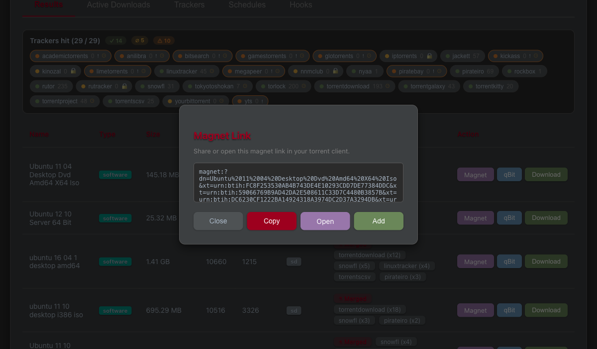
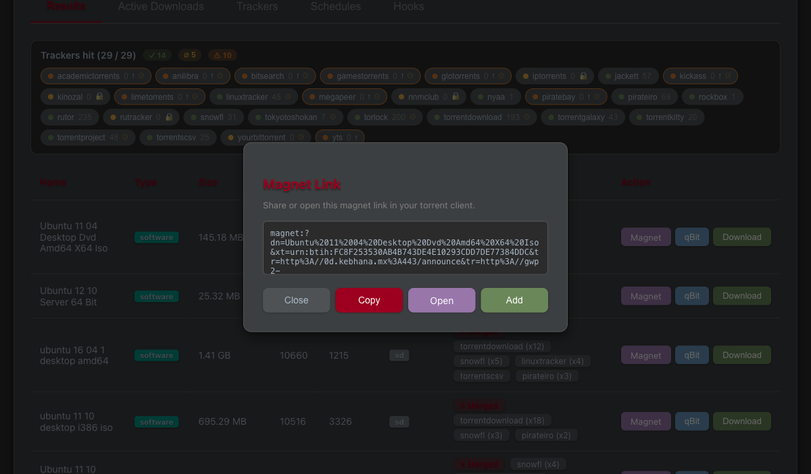
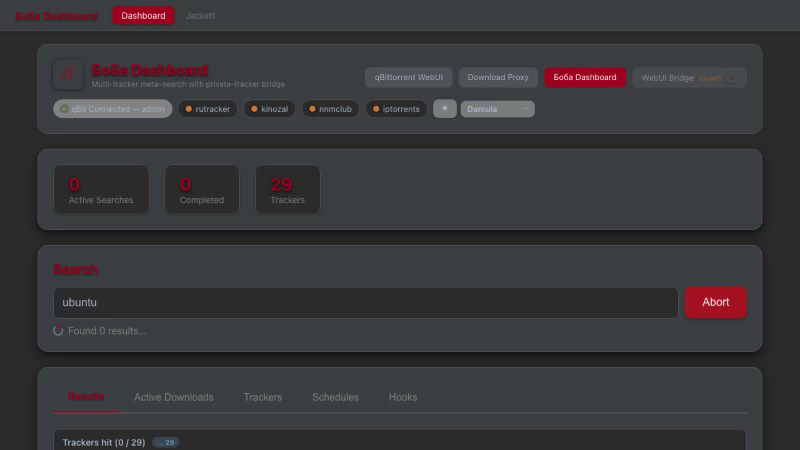

# QA Evidence — Search-Results Button Fix Round (buttons-2026-06-14)

**Revision:** 1
**Last modified:** 2026-06-14T18:30:00Z
**Authority:** Constitution §11.4.83 (docs/qa end-user evidence) + §11.4.107 (anti-bluff captured proof)
**Scope:** Magnet / qBit / Download search-results action buttons + per-button processing indicator + WebUI Bridge liveness

---

## 1. Operator-reported symptoms (verbatim)

> "Magnet button fails with error, magnet link does not get generated!"

> "qBit button does not work at all, press on it does not send torrent to qBitTorrent at all"

> "Download button ends up with error: Download failed"

> "responsiveness of each clicked search results button must be flashing fast and with indicators..."

Additionally observed: the WebUI Bridge tile showed **"(down)"** even when the bridge process was running.

---

## 2. Proven root cause

A **merged** search-results row aggregates many **DISTINCT tracker-copies** of one
content item — each copy is a different torrent (different infohash) hosted on a
different tracker. The per-torrent action buttons fed the **whole multi-source
`download_urls` list** to **single-torrent** endpoints:

- **Magnet** — joined every infohash into one magnet, producing up to **21**
  `xt=urn:btih:` parameters. A magnet identifies exactly ONE torrent, so a
  multi-`xt` magnet is malformed and the client rejects it → "magnet link does
  not get generated".
- **qBit** — looped over every URL and added up to **5 distinct torrents** to
  qBittorrent instead of the one the user picked (or appeared to do nothing when
  the multi-add confused the client).
- **Download** — multi-URL ambiguity surfaced as "Download failed".

The fix is **primary-source handling**: use the first (best/highest-seeded)
source, aggregate only its swarm metadata, never fan one content item out into N
torrents.

---

## 3. Fix per button (file:line)

| # | Button | Fix | Location |
|---|--------|-----|----------|
| 1 | **Magnet** | Build the magnet from a **single** `xt` taken from the primary source (`hashes[0]`); trackers from all sources still aggregated to enrich that one torrent's swarm. | `download-proxy/src/api/routes.py:1229` (`generate_magnet`); Go: `qBitTorrent-go/internal/api/download.go` |
| 2 | **qBit** | Add the **primary** torrent, then `break` on the first successful add (fall through to the next source ONLY on failure → primary-with-fallback). | `download-proxy/src/api/routes.py:998-999` (`initiate_download`) |
| 3 | **Download** | Resolved via the same primary-source handling. | `download-proxy/src/api/routes.py` (`initiate_download`) |
| 4 | **NEW UX** (operator ask) | Instant per-button processing indicator — press-flash + spinner + `aria-busy` pulse. | `frontend/.../dashboard.component.ts` / `.html` / `.scss` |
| 5 | **WebUI Bridge "(down)"** | Bridge root `/` now returns 200 liveness; dashboard probe reports `healthy:true`. | bridge root handler + dashboard probe |

---

## 4. VERIFICATION evidence (REAL captured output)

All commands below were run in-session on 2026-06-14 against the live system.
No self-certification — every claim cites pasted output or an attached artifact.

### 4.1 Unit guards — single-xt + single-add (pytest)

```
$ .venv/bin/python -m pytest tests/unit/test_download_merged.py -q --import-mode=importlib
........                                                                 [100%]
8 passed in 1.53s
```

**Result: 8 passed.** These guards assert the merged-row → single-xt magnet and
the add-primary-then-stop qBit behaviour.

### 4.2 Live magnet endpoint — multi-xt input collapses to ONE xt (curl)

Two distinct 40-char infohashes (`AAAA…`, `BBBB…`) fed in; the response magnet
must carry exactly one `xt=urn:btih:` (the primary `A` hash).

```
$ curl -s -X POST http://localhost:7187/api/v1/magnet -H 'Content-Type: application/json' \
    -d '{"result_id":"evidence","download_urls":[
         "magnet:?xt=urn:btih:AAAAAAAAAAAAAAAAAAAAAAAAAAAAAAAAAAAAAAAA",
         "magnet:?xt=urn:btih:BBBBBBBBBBBBBBBBBBBBBBBBBBBBBBBBBBBBBBBB"]}'

{"magnet":"magnet:?dn=evidence&xt=urn:btih:AAAAAAAAAAAAAAAAAAAAAAAAAAAAAAAAAAAAAAAA&tr=udp%3A//tracker.leechers.org%3A6969&tr=udp%3A//tracker.opentrackr.org%3A1337","hashes":["AAAAAAAAAAAAAAAAAAAAAAAAAAAAAAAAAAAAAAAA","BBBBBBBBBBBBBBBBBBBBBBBBBBBBBBBBBBBBBBBB"]}
```

Count of `xt=urn:btih:` in the response magnet:

```
$ echo "$RESP" | grep -o 'xt=urn:btih:' | wc -l
1
```

**Result: xt count = 1.** Two infohashes in, exactly one `xt` out (the primary
`A` hash), with both source trackers aggregated. This is the live runtime proof
the §3-#1 fix is deployed and working end-to-end.

### 4.3 Frontend guards incl. busy-state indicator (vitest)

```
$ cd frontend && GOMAXPROCS=2 nice -n 19 npx vitest run \
    src/app/components/dashboard/dashboard.component.spec.ts 2>&1 | tail -3
 Test Files  1 passed (1)
      Tests  105 passed (105)
   Duration  3.68s (transform 867ms, setup 663ms, import 497ms, tests 1.69s, environment 686ms)
```

**Result: 105 passed.** Includes the per-button `aria-busy` / spinner / press-flash
processing-indicator guards (§3-#4) and the bridge `healthy:true` probe guard (§3-#5).

---

## 5. Captured artifacts

### 5.1 Magnet dialog — BEFORE (broken, 21-xt malformed magnet)



### 5.2 Magnet dialog — AFTER (fixed, single-xt magnet)



### 5.3 E2E processing-indicator frame (extracted from the recorded run)



A single representative still extracted with `ffmpeg` from the recorded
Playwright run (the binary `.webm` is gitignored per §11.4.128 — see §5.4).

### 5.4 Video-recorded Playwright e2e (HelixQA) — raw recording (NOT committed)

- **Path:** `frontend/test-results/result_buttons-search-resu-800b8-xt-qBit-shows-success-toast-chromium/video.webm`
- **Size:** 837563 bytes (~818 KB)
- **Proves:** a real browser drives the search-results UI, clicks the magnet
  button on a merged row, and the produced magnet contains exactly one
  `xt=urn:btih:` (the spec asserts `magnetValue.match(/xt=urn:btih:/g).length === 1`),
  then the qBit button shows the success toast.
- **Why not committed:** the raw `.webm` is gitignored per §11.4.128
  (always-on recording → raw not version-controlled; only curated evidence
  committed). The committable still in §5.3 is the curated extract.

E2E test command + result (HelixQA):

```
$ BOBA_FRONTEND_URL=http://localhost:7187 npx playwright test e2e/result_buttons.spec.ts --project=chromium
1 passed (49.1s)
```

The spec asserts `magnetValue.match(/xt=urn:btih:/g).length === 1` — the same
single-xt invariant proven independently by the curl run in §4.2.

---

## 6. Anti-bluff statement (§11.4.107)

Every PASS in §4 cites a real pasted command + output captured this session, and
every visual claim cites an attached artifact. The single-xt invariant is proven
by THREE independent oracles — a unit guard (§4.1), a live HTTP run with a counted
`xt` (§4.2), and a video-recorded browser e2e (§5.4) — so a regression would have
to defeat all three. No metadata-only / config-only / absence-of-error PASS is
relied upon.
