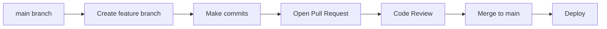
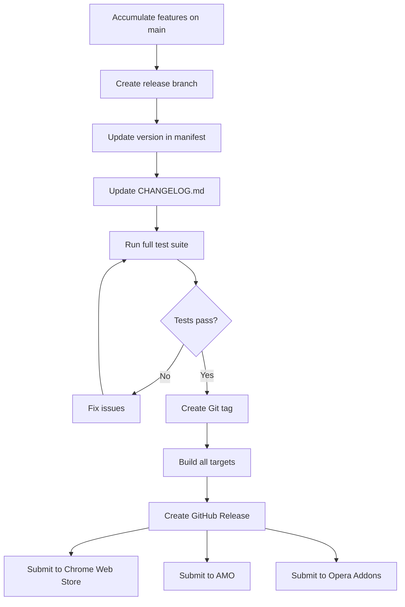

# BobaLink Browser Extension — Developer Guide

**Document Version**: 1.0.0  
**Last Updated**: 2026-06-06  
**Audience**: Contributors, Fork Maintainers, Advanced Users  
**Companion Documents**: [Technical Specification](technical-specification.md) | [API Reference](api-reference.md) | [Installation Guide](installation-guide.md)

---

## Table of Contents

1. [Development Environment Setup](#1-development-environment-setup)
2. [Project Structure](#2-project-structure)
3. [Building from Source](#3-building-from-source)
4. [Testing](#4-testing)
5. [Code Style and Conventions](#5-code-style-and-conventions)
6. [Architecture Decisions](#6-architecture-decisions)
7. [Contributing](#7-contributing)
8. [Extending the Extension](#8-extending-the-extension)
9. [Debugging](#9-debugging)

---

## 1. Development Environment Setup

### 1.1 Prerequisites

Before you begin, ensure your development machine meets the following requirements:

| Requirement | Minimum Version | Recommended | Purpose |
|---|---|---|---|
| Node.js | 18 LTS | 20 LTS | Runtime and package management |
| npm | 9.x | 10.x | Package manager (bundled with Node.js) |
| Git | 2.40 | 2.43+ | Version control |
| A supported browser | Chrome 88+ | Chrome 120+ | Testing and debugging |

**Verify your environment:**

```bash
node --version    # Should print v18.x.x or higher
npm --version     # Should print 9.x.x or higher
git --version     # Should print 2.40+ or higher
```

### 1.2 Cloning the Repository

```bash
# Clone the repository
git clone https://github.com/bobaproject/bobalink.git

# Navigate to the project directory
cd bobalink

# Install dependencies
npm install
```

The `npm install` command installs all development and runtime dependencies. This may take 2–5 minutes depending on your connection speed.

### 1.3 Installing Dependencies

Key dependencies that will be installed:

| Package | Version | Purpose |
|---|---|---|
| `wxt` | ^0.17 | Extension build framework |
| `typescript` | ^5.0 | Type safety |
| `vite` | ^5.0 | Module bundler (via WXT) |
| `jest` | ^29.0 | Unit testing framework |
| `@playwright/test` | ^1.40 | E2E testing framework |
| `eslint` | ^8.0 | Code linting |
| `prettier` | ^3.0 | Code formatting |
| `bencode-js` | ^3.0 | Bencode parsing for `.torrent` files |
| `lz-string` | ^1.5 | Compression for queue storage |
| `webextension-polyfill` | ^0.10 | Firefox compatibility |

### 1.4 IDE Recommendations

#### Visual Studio Code (Recommended)

VS Code provides the best development experience for BobaLink. Recommended configuration:

**`.vscode/settings.json`:**

```json
{
  "editor.formatOnSave": true,
  "editor.defaultFormatter": "esbenp.prettier-vscode",
  "editor.codeActionsOnSave": {
    "source.fixAll.eslint": "explicit"
  },
  "typescript.tsdk": "node_modules/typescript/lib",
  "typescript.preferences.importModuleSpecifier": "relative",
  "files.exclude": {
    "**/node_modules": true,
    "**/.output": true,
    "**/dist": true
  },
  "search.exclude": {
    "**/node_modules": true,
    "**/dist": true,
    "**/.output": true,
    "**/*.lock": true
  }
}
```

**`.vscode/extensions.json`:**

```json
{
  "recommendations": [
    "esbenp.prettier-vscode",
    "dbaeumer.vscode-eslint",
    "ms-vscode.vscode-typescript-next",
    "bradlc.vscode-tailwindcss",
    "ryanluker.vscode-coverage-gutters",
    "orta.vscode-jest"
  ]
}
```

**Recommended Extensions:**

| Extension | Publisher | Purpose |
|---|---|---|
| Prettier | esbenp.prettier-vscode | Code formatting |
| ESLint | dbaeumer.vscode-eslint | Real-time linting |
| Tailwind CSS IntelliSense | bradlc.vscode-tailwindcss | CSS autocomplete |
| Coverage Gutters | ryanluker.vscode-coverage-gutters | Visual test coverage |
| Jest | orta.vscode-jest | Test runner integration |

#### WebStorm / IntelliJ IDEA

If using JetBrains IDEs:
1. Enable the Prettier plugin: **Settings → Languages & Frameworks → JavaScript → Prettier**.
2. Enable ESLint: **Settings → Languages & Frameworks → JavaScript → Code Quality Tools → ESLint**.
3. Set TypeScript version: **Settings → Languages & Frameworks → TypeScript** → point to `node_modules/typescript/lib`.

---

## 2. Project Structure

### 2.1 Directory Layout

```
bobalink/
├── src/
│   ├── assets/              # Static assets (icons, images)
│   │   ├── icon-16.png
│   │   ├── icon-32.png
│   │   ├── icon-48.png
│   │   └── icon-128.png
│   ├── background/          # Service worker (MV3 background script)
│   │   ├── index.ts         # Entry point
│   │   ├── message-router.ts
│   │   └── init.ts
│   ├── content-scripts/     # Scripts injected into web pages
│   │   ├── index.ts         # Entry point
│   │   ├── magnet-scanner.ts
│   │   ├── dom-observer.ts
│   │   └── torrent-parser.ts
│   ├── popup/               # Toolbar popup UI
│   │   ├── index.html
│   │   ├── index.ts
│   │   ├── popup.css
│   │   └── components/
│   │       ├── torrent-list.ts
│   │       ├── queue-view.ts
│   │       ├── status-bar.ts
│   │       └── tab-groups.ts
│   ├── options/             # Options/settings page
│   │   ├── index.html
│   │   ├── index.ts
│   │   ├── options.css
│   │   └── components/
│   │       ├── server-config.ts
│   │       ├── download-prefs.ts
│   │       ├── queue-settings.ts
│   │       └── ui-settings.ts
│   ├── modules/             # Shared business logic modules
│   │   ├── api-client.ts
│   │   ├── auth-manager.ts
│   │   ├── badge-manager.ts
│   │   ├── config-manager.ts
│   │   ├── crypto-utils.ts
│   │   ├── discovery-service.ts
│   │   ├── health-monitor.ts
│   │   ├── i18n.ts
│   │   ├── notification-manager.ts
│   │   ├── queue-manager.ts
│   │   ├── rate-limiter.ts
│   │   ├── state-manager.ts
│   │   └── tab-manager.ts
│   ├── types/               # TypeScript type definitions
│   │   ├── index.ts
│   │   ├── messages.ts
│   │   ├── torrent.ts
│   │   ├── config.ts
│   │   └── api.ts
│   └── utils/               # Utility functions
│       ├── bencode.ts
│       ├── hash.ts
│       ├── magnet-uri.ts
│       ├── storage.ts
│       ├── time.ts
│       └── validation.ts
├── tests/
│   ├── unit/                # Jest unit tests
│   │   ├── modules/
│   │   ├── utils/
│   │   └── setup.ts
│   ├── e2e/                 # Playwright E2E tests
│   │   ├── fixtures/
│   │   ├── specs/
│   │   └── playwright.config.ts
│   └── mocks/               # Test mocks
│       ├── chrome-api.ts
│       └── fetch.ts
├── public/                  # Public static files
├── _locales/                # Internationalization
│   ├── en/
│   ├── zh_CN/
│   ├── es/
│   └── ...
├── wxt.config.ts            # WXT build configuration
├── tsconfig.json            # TypeScript configuration
├── jest.config.ts           # Jest test configuration
├── eslint.config.js         # ESLint configuration
├── prettier.config.js       # Prettier configuration
├── package.json             # Project manifest
└── README.md
```

### 2.2 Module Descriptions

#### Background (Service Worker)

| Module | Responsibility |
|---|---|
| `index.ts` | Service worker entry point; registers event listeners |
| `message-router.ts` | Routes incoming extension messages to appropriate handlers |
| `init.ts` | Extension initialization: config loading, health monitoring startup |

#### Content Scripts

| Module | Responsibility |
|---|---|
| `index.ts` | Content script entry; initializes scanner and observer |
| `magnet-scanner.ts` | Scans DOM for magnet links and `.torrent` references |
| `dom-observer.ts` | `MutationObserver` wrapper for dynamic content detection |
| `torrent-parser.ts` | Parses magnet URIs and `.torrent` file metadata |

#### Modules (Shared Logic)

| Module | Responsibility |
|---|---|
| `api-client.ts` | HTTP client for Boba and qBitTorrent API calls |
| `auth-manager.ts` | Authentication: login, token refresh, session management |
| `badge-manager.ts` | Toolbar badge state: color, text, animations |
| `config-manager.ts` | Configuration CRUD with validation and persistence |
| `crypto-utils.ts` | AES-256-GCM encryption, PBKDF2 key derivation |
| `discovery-service.ts` | mDNS-like local network server discovery |
| `health-monitor.ts` | Periodic health checks; connection state management |
| `i18n.ts` | Internationalization: message lookup, locale detection |
| `notification-manager.ts` | Browser notification creation and management |
| `queue-manager.ts` | Offline queue: enqueue, dequeue, retry scheduling |
| `rate-limiter.ts` | Token bucket rate limiter for API calls |
| `state-manager.ts` | Central state store; reactive updates to UI |
| `tab-manager.ts` | Tab group enumeration; batch scan orchestration |

#### Types

| Module | Responsibility |
|---|---|
| `index.ts` | Barrel export for all types |
| `messages.ts` | Extension message passing types |
| `torrent.ts` | TorrentInfo and related types |
| `config.ts` | ExtensionConfig and sub-configuration types |
| `api.ts` | API request/response types for Boba and qBitTorrent |

---

## 3. Building from Source

### 3.1 Development Build

Start the development server with hot module replacement:

```bash
npm run dev
```

This command:
1. Starts WXT in development mode.
2. Watches source files for changes and rebuilds automatically.
3. Outputs to `.output/` directory.
4. Provides a Chrome-compatible build by default.

**Output structure:**

```
.output/
├── chrome-mv3-dev/       # Chrome development build
│   ├── manifest.json
│   ├── background.js
│   ├── content-scripts/
│   ├── popup/
│   └── options/
```

**Loading the development build:**

| Browser | Steps |
|---|---|
| Chrome | `chrome://extensions` → Enable "Developer mode" → "Load unpacked" → Select `.output/chrome-mv3-dev/` |
| Firefox | `about:debugging` → "This Firefox" → "Load Temporary Add-on" → Select `manifest.json` from `.output/firefox-mv3-dev/` |
| Opera | `opera://extensions` → Enable "Developer mode" → "Load unpacked" |

### 3.2 Production Build

Create optimized production builds for all targets:

```bash
npm run build
```

This generates:

```
.output/
├── chrome-mv3-prod/      # Chrome production build
├── firefox-mv3-prod/     # Firefox production build
├── opera-mv3-prod/       # Opera production build
└── edge-mv3-prod/        # Edge production build (same as Chrome)
```

Each build is:
- Minified and tree-shaken.
- Source-mapped (`.map` files).
- Ready for packaging as ZIP for store submission.

### 3.3 Cross-Browser Builds

Build for specific browsers:

```bash
# Chrome only
npx wxt build -b chrome

# Firefox only
npx wxt build -b firefox

# Opera only
npx wxt build --browser opera
```

Browser-specific differences are handled by:
- WXT's browser-specific entry points (`popup/index.firefox.ts`).
- Conditional compilation via `import.meta.browser`.
- The `webextension-polyfill` package for API normalization.

### 3.4 Build Configuration

**`wxt.config.ts`:**

```typescript
import { defineConfig } from 'wxt';

export default defineConfig({
  srcDir: 'src',
  outDir: '.output',
  modules: ['@wxt-dev/module-typescript'],
  manifest: {
    name: '__MSG_extName__',
    description: '__MSG_extDescription__',
    version: '1.0.0',
    permissions: ['activeTab', 'storage', 'contextMenus', 'notifications'],
    host_permissions: ['https://*/'],
    action: {
      default_popup: 'popup/index.html'
    },
    options_ui: {
      page: 'options/index.html',
      open_in_tab: true
    },
    commands: {
      'send-current-page': {
        suggested_key: { default: 'Ctrl+Shift+B', mac: 'Command+Shift+B' },
        description: 'Send all torrents on current page'
      }
    }
  }
});
```

---

## 4. Testing

### 4.1 Running Unit Tests

Execute the full unit test suite:

```bash
npm test
```

Or with Jest directly for more control:

```bash
# Run all tests
npx jest

# Run with coverage
npx jest --coverage

# Run in watch mode (during development)
npx jest --watch

# Run a specific test file
npx jest tests/unit/utils/magnet-uri.test.ts

# Run tests matching a pattern
npx jest --testNamePattern="parseMagnetUri"
```

**Coverage reporting:**

Coverage reports are generated in `coverage/`:

```
coverage/
├── lcov-report/       # HTML report (open index.html in browser)
├── lcov.info          # LCOV format for CI integration
└── coverage-summary.json
```

**Coverage thresholds (enforced in CI):**

| Metric | Minimum |
|---|---|
| Statements | 80% |
| Branches | 75% |
| Functions | 80% |
| Lines | 80% |

### 4.2 Running E2E Tests

End-to-end tests use Playwright to automate real browser interactions:

```bash
# Install Playwright browsers (one-time setup)
npx playwright install chromium firefox

# Run all E2E tests
npm run test:e2e

# Run in headed mode (visible browser)
npx playwright test --headed

# Run a specific spec
npx playwright test tests/e2e/specs/detection.spec.ts

# Run with UI mode (interactive debugging)
npx playwright test --ui

# Run on specific browser
npx playwright test --project=chromium
n```

**E2E Test Structure:**

```
tests/e2e/
├── fixtures/               # Test data
│   ├── sample.torrent
│   ├── magnet-links.html
│   └── mock-server.ts
├── specs/                  # Test specifications
│   ├── detection.spec.ts   # Torrent detection tests
│   ├── sending.spec.ts     # Send-to-server tests
│   ├── queue.spec.ts       # Queue management tests
│   ├── auth.spec.ts        # Authentication tests
│   └── settings.spec.ts    # Options page tests
├── page-objects/           # Page Object Models
│   ├── popup.page.ts
│   ├── options.page.ts
│   └── mock-server.page.ts
└── playwright.config.ts    # Playwright configuration
```

### 4.3 Writing New Tests

#### Unit Test Template

```typescript
import { parseMagnetUri } from '@src/utils/magnet-uri';

describe('parseMagnetUri', () => {
  it('should parse a complete magnet URI', () => {
    const uri = 'magnet:?xt=urn:btih:abc123def456&dn=Test+File&tr=https://tracker.example.com/announce';
    const result = parseMagnetUri(uri);

    expect(result.infohash).toBe('abc123def456');
    expect(result.displayName).toBe('Test File');
    expect(result.trackers).toContain('https://tracker.example.com/announce');
  });

  it('should throw on invalid magnet URI', () => {
    expect(() => parseMagnetUri('not-a-magnet')).toThrow('Invalid magnet URI');
  });

  it('should handle missing display name', () => {
    const uri = 'magnet:?xt=urn:btih:abc123def456';
    const result = parseMagnetUri(uri);
    expect(result.displayName).toBe('Unknown Torrent');
  });
});
```

#### E2E Test Template

```typescript
import { test, expect } from '@playwright/test';
import { PopupPage } from '../page-objects/popup.page';

test.describe('Torrent Detection', () => {
  test('should detect magnet links on a page', async ({ page, extensionId }) => {
    // Arrange: Load a test page with magnet links
    await page.goto(`file://${__dirname}/../fixtures/magnet-links.html`);

    // Act: Open the extension popup
    const popup = new PopupPage(page, extensionId);
    await popup.open();

    // Assert: Verify torrents are listed
    const torrentCount = await popup.getTorrentCount();
    expect(torrentCount).toBe(3);

    const firstTorrentName = await popup.getTorrentName(0);
    expect(firstTorrentName).toContain('Ubuntu');
  });
});
```

### 4.4 Test Coverage Reports

Generate and view coverage:

```bash
npm run test:coverage
```

The HTML report opens automatically. Key files to monitor:

| File | Target | Notes |
|---|---|---|
| `src/modules/api-client.ts` | 90% | Critical for reliability |
| `src/modules/crypto-utils.ts` | 95% | Security-critical |
| `src/modules/queue-manager.ts` | 85% | Core functionality |
| `src/content-scripts/magnet-scanner.ts` | 80% | User-facing |
| `src/utils/magnet-uri.ts` | 95% | Pure functions, easy to test |

---

## 5. Code Style and Conventions

### 5.1 TypeScript Strict Mode

The project uses TypeScript strict mode. Key rules:

```json
{
  "compilerOptions": {
    "strict": true,
    "noImplicitAny": true,
    "strictNullChecks": true,
    "strictFunctionTypes": true,
    "strictBindCallApply": true,
    "strictPropertyInitialization": true,
    "noImplicitReturns": true,
    "noFallthroughCasesInSwitch": true,
    "noUncheckedIndexedAccess": true
  }
}
```

**No `any` types in production code.** Use `unknown` with type guards:

```typescript
// Bad
function process(data: any): any {
  return data.value;
}

// Good
function process(data: unknown): string {
  if (typeof data === 'object' && data !== null && 'value' in data) {
    return String((data as Record<string, unknown>).value);
  }
  throw new TypeError('Invalid data shape');
}
```

### 5.2 ESLint Configuration

```javascript
// eslint.config.js
export default [
  {
    files: ['src/**/*.ts'],
    languageOptions: {
      parser: '@typescript-eslint/parser',
      parserOptions: {
        project: './tsconfig.json'
      }
    },
    plugins: {
      '@typescript-eslint': typescriptEslint
    },
    rules: {
      '@typescript-eslint/no-explicit-any': 'error',
      '@typescript-eslint/no-unused-vars': ['error', { argsIgnorePattern: '^_' }],
      '@typescript-eslint/explicit-function-return-type': 'warn',
      '@typescript-eslint/no-non-null-assertion': 'error',
      '@typescript-eslint/prefer-nullish-coalescing': 'error',
      '@typescript-eslint/prefer-optional-chain': 'error',
      'no-console': ['warn', { allow: ['error', 'warn'] }]
    }
  }
];
```

### 5.3 Prettier Configuration

```javascript
// prettier.config.js
export default {
  semi: true,
  trailingComma: 'es5',
  singleQuote: true,
  printWidth: 100,
  tabWidth: 2,
  useTabs: false,
  bracketSpacing: true,
  arrowParens: 'avoid'
};
```

### 5.4 Naming Conventions

| Construct | Convention | Example |
|---|---|---|
| Variables / Functions | camelCase | `sendTorrent`, `getStatus` |
| Constants | UPPER_SNAKE_CASE | `MAX_QUEUE_SIZE`, `DEFAULT_TIMEOUT` |
| Types / Interfaces | PascalCase | `TorrentInfo`, `ServerConfig` |
| Classes | PascalCase | `QueueManager`, `ApiClient` |
| Enums | PascalCase + PascalCase members | `enum ConnectionState { Connected, Disconnected }` |
| Files | kebab-case | `magnet-scanner.ts`, `crypto-utils.ts` |
| Test files | `*.test.ts` or `*.spec.ts` | `magnet-uri.test.ts` |
| Private members | Leading underscore | `_internalQueue`, `_timerId` |

### 5.5 Comment Style (JSDoc)

All public APIs must include JSDoc comments:

```typescript
/**
 * Parses a magnet URI string into a structured TorrentInfo object.
 *
 * @param uri - The raw magnet URI (e.g., "magnet:?xt=urn:btih:abc123...")
 * @returns Parsed torrent metadata
 * @throws {ValidationError} If the URI format is invalid
 *
 * @example
 * ```typescript
 * const info = parseMagnetUri('magnet:?xt=urn:btih:abc123&dn=Example');
 * console.log(info.infohash); // 'abc123...'
 * ```
 */
export function parseMagnetUri(uri: string): TorrentInfo {
  // Implementation
}
```

Comment guidelines:
- Explain **why**, not **what** (the code shows what).
- Document all parameters, return values, and thrown errors.
- Include usage examples for complex functions.
- Use `TODO(username): description` for known technical debt.
- Use `FIXME(username): description` for bugs that need fixing.

---

## 6. Architecture Decisions

### 6.1 Why MV3 Over MV2

**Decision**: Use Manifest V3 (MV3) instead of Manifest V2 (MV2).

**Rationale:**

| Factor | MV2 | MV3 | Winner |
|---|---|---|---|
| Chrome Web Store acceptance | Being deprecated | Required for new extensions | MV3 |
| Service worker vs background page | Persistent background page | Ephemeral service worker | MV3 |
| Performance | Background page always running | Service worker wakes on events | MV3 |
| Memory usage | Higher (persistent) | Lower (ephemeral) | MV3 |
| Network request modification | `webRequest` blocking | `declarativeNetRequest` | MV2* |
| Cross-browser support | Legacy only | Modern standard | MV3 |

\* BobaLink does not need to block/modify network requests, so the `webRequest` limitation of MV3 is not a factor.

**Mitigations for MV3 limitations:**
- Service worker persistence: Use `chrome.alarms` API to keep the worker alive during active operations.
- Storage: Use `chrome.storage` (local and session) instead of in-memory state.
- All Chrome, Firefox, Opera, and Yandex versions targeted by BobaLink support MV3.

### 6.2 Why WXT Over Raw Webpack/Vite

**Decision**: Use WXT as the build framework instead of configuring Webpack or Vite manually.

**Rationale:**

| Factor | Raw Vite | WXT | Winner |
|---|---|---|---|
| Extension-specific scaffolding | None | Built-in | WXT |
| HMR for content scripts | Manual config | Automatic | WXT |
| Multi-browser builds | Manual config | Automatic | WXT |
| Manifest generation | Manual | Auto-generated from config | WXT |
| File-based routing | None | Entry points auto-discovered | WXT |
| Dev server with auto-reload | Manual config | Built-in | WXT |
| Bundle size | Comparable | Comparable (thin wrapper) | Tie |
| Community size | Large | Growing | Vite |

**WXT specifically solves:**
- Automatic discovery of `src/popup/`, `src/options/`, `src/background/`, `src/content-scripts/` entries.
- Browser-specific build variants (Chrome MV3, Firefox MV3 with polyfills).
- Dev mode that auto-reloads the extension on file change.
- Automatic i18n message placeholder substitution in the manifest.

### 6.3 Why activeTab Over host_permissions

**Decision**: Use `activeTab` as the primary permission model instead of broad `host_permissions`.

**Rationale:**

`activeTab` grants temporary access to the current tab only when the user interacts with the extension. This is more privacy-respecting and requires fewer permission prompts at install time.

| Permission Model | Install Prompt | Privacy | Functionality |
|---|---|---|---|
| `host_permissions: <all_urls>` | Scary "read all website data" | Poor | Works on all pages |
| `activeTab` | No prompt (on-demand) | Excellent | Works on current tab only |

**Implementation:**
- Primary detection uses `activeTab` + user gesture (clicking the extension icon).
- Optional `host_permissions` for advanced users who want proactive detection without interaction.
- The `optional_permissions` field in the manifest allows users to grant additional access.

### 6.4 Why AES-256-GCM for Encryption

**Decision**: Use AES-256-GCM via the Web Crypto API for credential encryption.

**Rationale:**

| Algorithm | Mode | Authentication | Performance | Standard |
|---|---|---|---|---|
| AES-128-CBC | No | No (requires HMAC) | Fast | Legacy |
| AES-256-CBC | No | No (requires HMAC) | Fast | Legacy |
| AES-256-GCM | Yes | Built-in | Fast | Modern standard |
| ChaCha20-Poly1305 | Yes | Built-in | Fast | Alternative |

AES-256-GCM was chosen because:
1. It provides authenticated encryption (confidentiality + integrity) in a single operation.
2. It is widely supported by the Web Crypto API in all targeted browsers.
3. It is a NIST standard with extensive cryptanalysis and hardware acceleration support.
4. ChaCha20-Poly1305 is excellent but less universally accelerated on x86 hardware.

**Key derivation:**
- Master key derived from user password via PBKDF2 with 100,000 iterations.
- Per-entry random IV (96-bit) generated via `crypto.getRandomValues()`.
- 128-bit authentication tag validated on every decryption.

---

## 7. Contributing

### 7.1 Git Workflow (GitHub Flow)

BobaLink follows the GitHub Flow branching model:



**Branch naming conventions:**

| Prefix | Purpose | Example |
|---|---|---|
| `feature/` | New features | `feature/tab-group-batch` |
| `bugfix/` | Bug fixes | `bugfix/badge-color-update` |
| `hotfix/` | Critical production fixes | `hotfix/auth-race-condition` |
| `docs/` | Documentation updates | `docs/api-examples` |
| `refactor/` | Code refactoring | `refactor/queue-manager` |
| `test/` | Test additions/improvements | `test/queue-coverage` |

### 7.2 Commit Message Conventions (Conventional Commits)

All commits must follow the Conventional Commits specification:

```
<type>(<scope>): <description>

[optional body]

[optional footer(s)]
```

**Types:**

| Type | Use When | Example |
|---|---|---|
| `feat` | Adding a new feature | `feat(popup): add tab group selection UI` |
| `fix` | Fixing a bug | `fix(queue): resolve race condition on retry` |
| `docs` | Documentation changes | `docs(api): add qBitTorrent sync endpoint` |
| `style` | Code formatting (no logic change) | `style(lint): fix trailing commas` |
| `refactor` | Code restructuring | `refactor(auth): extract token refresh logic` |
| `test` | Adding or updating tests | `test(queue): add retry scheduling tests` |
| `chore` | Build/tooling changes | `chore(deps): update wxt to 0.17.0` |
| `perf` | Performance improvements | `perf(scanner): debounce mutation observer` |
| `security` | Security-related changes | `security(crypto): increase PBKDF2 iterations` |

**Scopes:**

| Scope | Description |
|---|---|
| `popup` | Popup UI |
| `options` | Options page |
| `content` | Content scripts |
| `background` | Service worker |
| `api` | API client |
| `queue` | Queue manager |
| `auth` | Authentication |
| `crypto` | Encryption utilities |
| `i18n` | Internationalization |
| `build` | Build system |
| `deps` | Dependencies |

**Breaking changes:**

Append `!` after the type/scope and include `BREAKING CHANGE:` in the footer:

```
feat(api)!: remove v1 auth endpoint

BREAKING CHANGE: The /api/v1/auth/login endpoint has been removed.
Use /api/v2/auth/token instead.
```

### 7.3 Pull Request Template

When opening a pull request, use this template:

```markdown
## Description
Brief description of the change and its purpose.

## Type of Change
- [ ] Bug fix
- [ ] New feature
- [ ] Breaking change
- [ ] Documentation update
- [ ] Refactoring

## Testing
- [ ] Unit tests added/updated
- [ ] E2E tests added/updated
- [ ] Manual testing performed

## Checklist
- [ ] Code follows project style guidelines
- [ ] Self-review completed
- [ ] JSDoc comments added for public APIs
- [ ] No `any` types introduced
- [ ] TypeScript compiles without errors
- [ ] ESLint passes without warnings
- [ ] Test coverage meets thresholds

## Related Issues
Fixes #123
Relates to #456
```

### 7.4 Code Review Checklist

Reviewers should verify:

| Check | Description |
|---|---|
| Functionality | Does the change do what it claims? |
| Tests | Are there adequate tests? Do they pass? |
| Edge cases | Are error paths and boundary conditions handled? |
| Security | Does the change introduce any security risks? |
| Performance | Could this cause performance issues at scale? |
| i18n | Are all user-facing strings externalized? |
| Accessibility | Are ARIA labels and keyboard navigation present? |
| Type safety | Are there no `any` types or unchecked nulls? |
| Documentation | Is JSDoc updated? Is the user guide updated if needed? |

### 7.5 Release Process



**Version numbering** follows Semantic Versioning (SemVer):

| Bump | When | Example |
|---|---|---|
| Major (X.0.0) | Breaking API changes | 2.0.0 |
| Minor (x.Y.0) | New features, backward compatible | 1.1.0 |
| Patch (x.y.Z) | Bug fixes, no API changes | 1.0.1 |

---

## 8. Extending the Extension

### 8.1 Adding New Torrent Site Selectors

Some torrent sites use non-standard HTML structures. You can add custom selectors:

1. Create a new file in `src/content-scripts/selectors/`:

```typescript
// src/content-scripts/selectors/nyaa-si.ts
import { SiteSelector } from '@src/types/selector';

export const nyaaSiSelector: SiteSelector = {
  // Match against hostname
  hostname: /nyaa\.si$/,

  // CSS selector for magnet links
  magnetSelector: 'a[href^="magnet:?"]',

  // CSS selector for .torrent file links
  torrentSelector: 'a[href$=".torrent"]',

  // Optional: Extract display name from a different element
  nameExtractor: (linkElement: HTMLAnchorElement): string | null => {
    const row = linkElement.closest('tr');
    if (row) {
      const titleCell = row.querySelector('td:nth-child(2) a');
      return titleCell?.textContent?.trim() || null;
    }
    return null;
  },

  // Optional: Extract size from page
  sizeExtractor: (linkElement: HTMLAnchorElement): number | null => {
    const row = linkElement.closest('tr');
    if (row) {
      const sizeCell = row.querySelector('td:nth-child(4)');
      return parseSizeString(sizeCell?.textContent || '');
    }
    return null;
  },

  // Optional: Custom scan logic
  customScanner?: (root: HTMLElement): Partial<TorrentInfo>[] => {
    // Advanced: scan page-specific structures
  }
};
```

2. Register the selector in `src/content-scripts/selectors/index.ts`:

```typescript
import { nyaaSiSelector } from './nyaa-si';

export const siteSelectors: SiteSelector[] = [
  // ... existing selectors
  nyaaSiSelector,
];
```

3. Write a test:

```typescript
// tests/unit/content-scripts/selectors/nyaa-si.test.ts
import { nyaaSiSelector } from '@src/content-scripts/selectors/nyaa-si';

describe('nyaaSiSelector', () => {
  it('should match nyaa.si hostname', () => {
    expect(nyaaSiSelector.hostname.test('nyaa.si')).toBe(true);
    expect(nyaaSiSelector.hostname.test('sukebei.nyaa.si')).toBe(true);
  });

  it('should extract name from table row', () => {
    document.body.innerHTML = `
      <table>
        <tr>
          <td></td>
          <td><a>My Torrent Title</a></td>
          <td></td>
          <td>1.2 GiB</td>
          <td><a href="magnet:?xt=urn:btih:abc123">Magnet</a></td>
        </tr>
      </table>
    `;
    const link = document.querySelector('a[href^="magnet"]') as HTMLAnchorElement;
    expect(nyaaSiSelector.nameExtractor?.(link)).toBe('My Torrent Title');
  });
});
```

### 8.2 Adding New Authentication Methods

To add a new authentication method (e.g., OAuth2):

1. Add the method to the `AuthMethod` union type:

```typescript
// src/types/config.ts
type AuthMethod = 'cookie' | 'api-key' | 'basic' | 'custom-header' | 'oauth2';
```

2. Implement the auth handler:

```typescript
// src/modules/auth/oauth2-handler.ts
import { AuthHandler, AuthCredentials } from '@src/types/auth';

export class OAuth2Handler implements AuthHandler {
  private token: string | null = null;
  private refreshToken: string | null = null;
  private expiresAt = 0;

  async authenticate(credentials: AuthCredentials): Promise<void> {
    const response = await fetch(`${credentials.serverUrl}/oauth/token`, {
      method: 'POST',
      headers: { 'Content-Type': 'application/json' },
      body: JSON.stringify({
        grant_type: 'password',
        client_id: credentials.clientId,
        username: credentials.username,
        password: credentials.password,
      }),
    });

    if (!response.ok) {
      throw new AuthError('OAuth2 authentication failed', { cause: response.status });
    }

    const data = await response.json();
    this.token = data.access_token;
    this.refreshToken = data.refresh_token;
    this.expiresAt = Date.now() + data.expires_in * 1000;
  }

  async getAuthHeaders(): Promise<Record<string, string>> {
    if (!this.token || Date.now() >= this.expiresAt) {
      await this.refresh();
    }
    return { Authorization: `Bearer ${this.token}` };
  }

  private async refresh(): Promise<void> {
    // Implementation
  }
}
```

3. Register the handler:

```typescript
// src/modules/auth-manager.ts
import { OAuth2Handler } from './auth/oauth2-handler';

const authHandlers: Record<AuthMethod, () => AuthHandler> = {
  'cookie': () => new CookieHandler(),
  'api-key': () => new ApiKeyHandler(),
  'basic': () => new BasicAuthHandler(),
  'custom-header': () => new CustomHeaderHandler(),
  'oauth2': () => new OAuth2Handler(), // Add this line
};
```

4. Update the Options UI to include OAuth2 configuration fields.

### 8.3 Adding New Keyboard Shortcuts

To add a new keyboard shortcut:

1. Define the command in the manifest:

```json
{
  "commands": {
    "send-current-page": {
      "suggested_key": { "default": "Ctrl+Shift+B" },
      "description": "Send all torrents on current page"
    },
    "your-new-command": {
      "suggested_key": { "default": "Ctrl+Shift+N" },
      "description": "Description of what it does"
    }
  }
}
```

2. Handle the command in the service worker:

```typescript
// src/background/index.ts
chrome.commands.onCommand.addListener(async (command, tab) => {
  switch (command) {
    case 'send-current-page':
      await handleSendCurrentPage(tab);
      break;
    case 'your-new-command':
      await handleYourNewCommand(tab);
      break;
  }
});
```

3. Implement the handler:

```typescript
// src/background/command-handlers.ts
export async function handleYourNewCommand(tab?: chrome.tabs.Tab): Promise<void> {
  if (!tab?.id) return;

  // Your implementation here
  const result = await chrome.tabs.sendMessage(tab.id, {
    type: 'YOUR_NEW_ACTION'
  });

  // Update badge or show notification
  await badgeManager.setStatus('processing');
}
```

4. Add i18n strings:

```json
{
  "command_your_new_command": {
    "message": "Your new command description"
  }
}
```

---

## 9. Debugging

### 9.1 Chrome DevTools for Extensions

**Service Worker:**
1. Navigate to `chrome://extensions`.
2. Find BobaLink and click **"Service Worker"** (under "Inspect views").
3. This opens DevTools dedicated to the service worker context.
4. Use the Console for logs, Network for API calls, and Sources for breakpoints.

**Content Script:**
1. Open the page where the content script is running.
2. Open DevTools (F12).
3. Go to the **Sources** panel.
4. In the file tree, find `chrome-extension://{extension-id}/`.
5. Set breakpoints in content script files.

**Popup:**
1. Click the BobaLink icon to open the popup.
2. Right-click inside the popup → **"Inspect"**.
3. This opens a dedicated DevTools window for the popup.

**Extension ID:**

| Mode | Extension ID Location |
|---|---|
| Development | `chrome://extensions` → BobaLink → ID field |
| Production | Fixed ID from Chrome Web Store |

### 9.2 Firefox about:debugging

1. Navigate to `about:debugging`.
2. Click **"This Firefox"**.
3. Find BobaLink under Extensions.
4. Click **"Inspect"** to open DevTools.
5. Use Browser Console (`Ctrl+Shift+J`) for all extension logs.

### 9.3 Viewing Service Worker Logs

The service worker logs extensively for debugging. Log levels:

```typescript
// src/utils/logger.ts
enum LogLevel {
  DEBUG = 0,   // Verbose internal state
  INFO = 1,    // Normal operations
  WARN = 2,    // Recoverable issues
  ERROR = 3,   // Failures requiring attention
}
```

**Enable debug logging:**

1. Open the service worker DevTools (see 9.1).
2. In the Console, run:
   ```javascript
   chrome.storage.local.set({ 'debugMode': true });
   ```
3. Reload the service worker from `chrome://extensions`.
4. Debug logs will appear in the Console.

**Log output examples:**

```
[BobaLink] [INFO]  Service worker initialized, version 1.0.0
[BobaLink] [DEBUG] Health check: GET https://boba.local:8443/health
[BobaLink] [INFO]  Health check passed: Boba v1.4.2, latency 45ms
[BobaLink] [DEBUG] Magnet detected: abc123... on https://example.com
[BobaLink] [INFO]  Torrent sent: abc123... (Ubuntu 24.04)
[BobaLink] [WARN]  Send failed for def456... (Network timeout), queued for retry
[BobaLink] [ERROR] Auth failed: invalid API key
```

### 9.4 Inspecting Storage

**Extension storage can be inspected via DevTools:**

| Storage Type | Chrome | Firefox |
|---|---|---|
| `chrome.storage.local` | DevTools → Application → Storage → Extension Storage | DevTools → Storage → Extension Storage |
| `chrome.storage.session` | DevTools → Application → Storage → Extension Storage (Session) | DevTools → Storage → Extension Storage |

**Viewing storage via console:**

```javascript
// View all stored data
chrome.storage.local.get(null, (data) => console.log(data));

// View configuration
chrome.storage.local.get('config', ({ config }) => console.log(config));

// View queue
chrome.storage.local.get('queue', ({ queue }) => console.log(queue));

// Clear all data (use with caution!)
chrome.storage.local.clear(() => console.log('Storage cleared'));
```

**Note:** Credential data is encrypted. You will see ciphertext, not plaintext passwords.

### 9.5 Common Debugging Scenarios

#### Scenario: Content Script Not Injecting

**Symptoms**: No torrents detected on any page.

**Diagnostic steps:**
1. Check DevTools → Console for injection errors.
2. Verify the content script is registered in `manifest.json`.
3. Check if the page has a restrictive CSP:
   ```javascript
   // In page console
   document.querySelector('meta[http-equiv="Content-Security-Policy"]')?.content
   ```
4. Check the service worker logs for injection errors.

#### Scenario: API Calls Failing

**Symptoms**: "Send failed" notifications, queue filling up.

**Diagnostic steps:**
1. Open service worker DevTools → Network tab.
2. Trigger a send and watch the request.
3. Check request headers (especially `Referer` for qBitTorrent).
4. Check response status and body.
5. Verify CORS headers if cross-origin.

#### Scenario: Queue Not Processing

**Symptoms**: Items stuck in queue, no retry attempts.

**Diagnostic steps:**
1. Check service worker is alive: `chrome://extensions` → Service Worker status.
2. Check for `chrome.alarms` registration:
   ```javascript
   chrome.alarms.getAll((alarms) => console.log(alarms));
   ```
3. Check queue processing logs in service worker console.
4. Manually trigger processing:
   ```javascript
   chrome.runtime.sendMessage({ type: 'PROCESS_QUEUE' });
   ```

#### Scenario: Encryption Issues

**Symptoms**: "Cannot decrypt credentials" errors.

**Diagnostic steps:**
1. Check if the encryption key exists in session storage:
   ```javascript
   chrome.storage.session.get('encryptionKey', (data) => {
     console.log('Key exists:', !!data.encryptionKey);
   });
   ```
2. If the key is missing, the browser was likely restarted without password protection.
3. Re-enter credentials in Options to re-establish the encryption key.

---

*End of Developer Guide*
