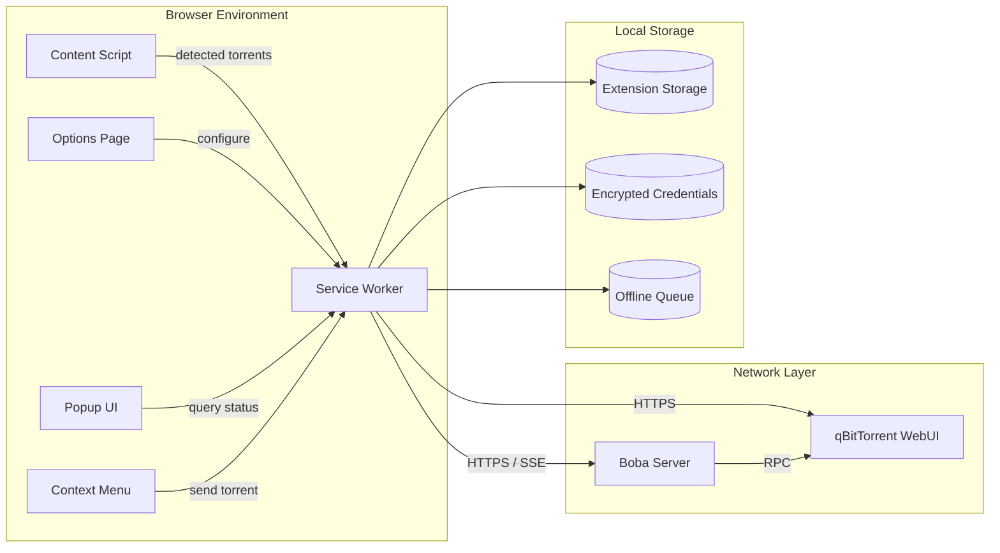
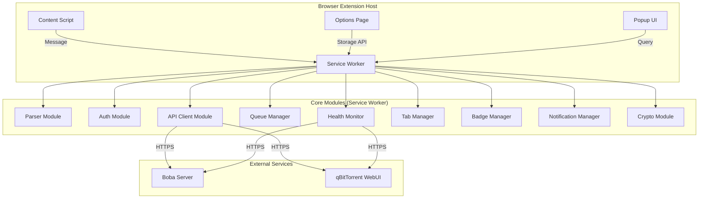
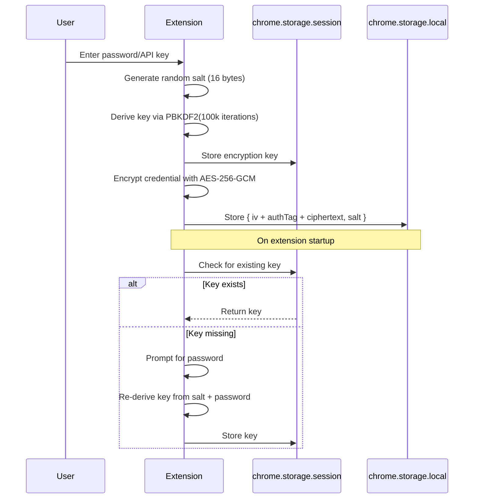
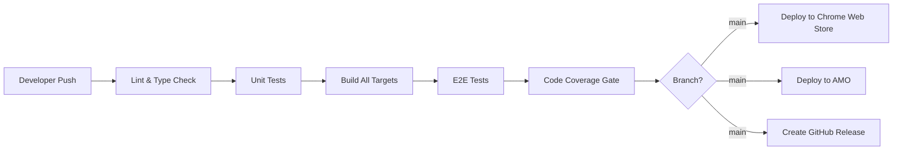

# BobaLink Browser Extension — Technical Specification

**Document Version**: 1.0.0  
**Last Updated**: 2026-06-06  
**Classification**: Internal — Engineering & Architecture  
**Owner**: Platform Engineering Team  
**Reviewers**: Architecture Review Board, Security Team, QA Lead

---

## Table of Contents

1. [Executive Summary](#1-executive-summary)
2. [System Overview](#2-system-overview)
3. [Functional Requirements](#3-functional-requirements)
4. [Non-Functional Requirements](#4-non-functional-requirements)
5. [System Architecture](#5-system-architecture)
6. [Data Models](#6-data-models)
7. [API Specifications](#7-api-specifications)
8. [Security Architecture](#8-security-architecture)
9. [Error Handling Strategy](#9-error-handling-strategy)
10. [Performance Considerations](#10-performance-considerations)
11. [Technology Stack](#11-technology-stack)
12. [Deployment Architecture](#12-deployment-architecture)
13. [Assumptions and Dependencies](#13-assumptions-and-dependencies)
14. [Risks and Mitigations](#14-risks-and-mitigations)
15. [Appendices](#15-appendices)

---

## 1. Executive Summary

BobaLink is a cross-browser WebExtension (Manifest V3) designed to bridge the gap between torrent discovery on the public internet and private download management infrastructure. The extension detects magnet links and `.torrent` file references on any web page, deduplicates them by cryptographic infohash, and transmits them to a Boba orchestration server or directly to a qBitTorrent WebUI instance for download management.

The extension addresses three core operational challenges:

1. **Discovery-to-Download Latency**: Users currently copy magnet links manually, switch applications, and paste them into download clients. BobaLink reduces this workflow to a single click.
2. **Batch Operation Efficiency**: Tab groups containing multiple torrent pages can be processed as atomic units, enabling bulk ingestion without per-tab interaction.
3. **Operational Resilience**: An offline-aware queue with exponential backoff ensures that transient network failures or service maintenance do not result in lost torrents.

BobaLink is built atop the WXT framework in TypeScript, targets Chrome (≥88), Firefox (≥109), Opera, and Yandex Browser, and adheres to WCAG 2.1 AA accessibility standards. All stored credentials are encrypted at rest using AES-256-GCM via the Web Crypto API.

### Key Metrics at a Glance

| Metric | Target |
|---|---|
| Extension Bundle Size (compressed) | ≤ 350 KB |
| Cold-start service worker | ≤ 50 ms |
| Magnet link detection latency | ≤ 5 ms per link |
| API call timeout | 30 s |
| Offline queue retention | 30 days |
| Supported browsers | 4 (Chrome, Firefox, Opera, Yandex) |
| Functional requirements | 25 |
| Non-functional requirements | 15 |

---

## 2. System Overview

BobaLink operates as a thin client within the browser's extension host environment. It does not perform any BitTorrent protocol operations itself; rather, it acts as an intelligent scraper and forwarding agent between the web browsing context and downstream download services.

### 2.1 High-Level Architecture



### 2.2 Core Workflows

**Workflow 1: Single Magnet Link Detection and Forward**
1. Content script observes the DOM mutation events on the active tab.
2. A magnet URI is matched against the regex pattern `^magnet:\?xt=urn:btih:[a-fA-F0-9]{40}`.
3. The link is parsed into a structured `TorrentInfo` object.
4. The torrent is sent to the service worker via `chrome.runtime.sendMessage()`.
5. The service worker enqueues the item or sends it immediately based on connectivity.
6. The target API (Boba or qBitTorrent) receives the torrent and initiates download.

**Workflow 2: Tab Group Batch Ingestion**
1. User triggers "Send Tab Group to Boba" from the popup or context menu.
2. Service worker enumerates all tabs in the specified tab group.
3. Each tab receives a `SCAN_REQUEST` message; content scripts extract all torrents.
4. Results are aggregated, deduplicated by infohash, and transmitted as a batch.

**Workflow 3: Auto-Discovery**
1. On first install (or when configuration is empty), the extension sends mDNS/Bonjour-like probes to well-known local network addresses.
2. Responsive Boba instances reply with their HTTPS endpoint and version.
3. The user is presented with a ranked list; selection persists to encrypted storage.

---

## 3. Functional Requirements

### 3.1 Torrent Detection and Parsing

#### FR-001: Detect Magnet Links on Any Web Page

| Attribute | Value |
|---|---|
| Priority | P0 — Critical |
| Actor | Content Script |
| Trigger | DOM mutation (`MutationObserver`) or page load |

The extension SHALL detect all magnet URI links (`href` attributes beginning with `magnet:?`) present in the DOM of any web page. Detection MUST occur dynamically as pages mutate via single-page application (SPA) navigation.

**Acceptance Criteria:**
- Magnet links in dynamically injected content (e.g., React/Vue re-renders) are detected within 500 ms.
- Detection works across all `http:` and `https:` origins.
- Magnet links inside iframes are detected when `all_frames` is enabled.

#### FR-002: Detect .torrent File Links

| Attribute | Value |
|---|---|
| Priority | P0 — Critical |
| Actor | Content Script |
| Trigger | Link pattern matching or header sniffing |

The extension SHALL detect hyperlinks to `.torrent` files by:
- URL path suffix matching (`.torrent` case-insensitive)
- `Content-Type: application/x-bittorrent` response header (when accessible via CORS or Fetch API)

#### FR-003: Parse Magnet URI Parameters

| Attribute | Value |
|---|---|
| Priority | P0 — Critical |
| Actor | Parser Module |

The extension SHALL parse the following magnet URI parameters per BEP-0009:

| Parameter | Name | Description |
|---|---|---|
| `xt` | Exact Topic | `urn:btih:` followed by 40-char hex infohash |
| `dn` | Display Name | Human-readable torrent name |
| `tr` | Tracker URL | Announce URL(s); may be repeated |
| `xl` | Exact Length | Total size in bytes (optional) |
| `ws` | Web Seed | Web seed URL(s) (optional) |
| `x.pe` | Peer Address | Known peer `host:port` (optional) |

**Validation Rules:**
- `xt` MUST be present and contain a valid 40-character hexadecimal infohash.
- `dn` SHOULD be present; if absent, fallback to `"Unknown Torrent"`.
- `tr` entries MUST be valid HTTP(S) URLs; malformed trackers are logged and discarded.

#### FR-004: Download and Parse .torrent Files

| Attribute | Value |
|---|---|
| Priority | P1 — High |
| Actor | Service Worker |
| Trigger | `.torrent` link detection or user action |

The extension SHALL download `.torrent` files via `fetch()` with the following constraints:
- Maximum file size: 10 MB (configurable via `maxTorrentFileSize` option).
- Timeout: 30 seconds.
- CORS policy: Falls back to proxying via Boba server when direct fetch is blocked.

The downloaded file SHALL be parsed using a Bencode decoder to extract:
- `info.name` — torrent name
- `info.piece length` — piece size
- `info.length` (or `info.files` for multi-file) — total size
- `announce` and `announce-list` — tracker URLs

#### FR-005: Compute Infohash from Torrent Data

| Attribute | Value |
|---|---|
| Priority | P1 — High |
| Actor | Crypto Module |

For `.torrent` files, the extension SHALL compute the SHA-1 hash over the Bencode-encoded `info` dictionary to produce the 40-character hex infohash. This MUST match the `xt` parameter if both are available.

```typescript
// Pseudocode for infohash computation
const infoBencoded = bencode.encode(torrent.info);
const infohashBuffer = await crypto.subtle.digest('SHA-1', infoBencoded);
const infohash = hexEncode(infohashBuffer); // 40-char lowercase hex
```

#### FR-006: Deduplicate Torrents by Infohash

| Attribute | Value |
|---|---|
| Priority | P1 — High |
| Actor | State Manager |

The extension SHALL maintain an in-memory `Map<string, TorrentInfo>` keyed by lowercase infohash. Duplicates (same infohash, different source page) are silently merged, preserving:
- The most descriptive `displayName` (longest string).
- The union of all tracker URLs from all sources.
- The earliest `detectedAt` timestamp.

### 3.2 Integration and Transmission

#### FR-007: Send Magnet Links to qBitTorrent via WebUI API

| Attribute | Value |
|---|---|
| Priority | P0 — Critical |
| Actor | API Client Module |

The extension SHALL transmit magnet URIs to qBitTorrent's `/api/v2/torrents/add` endpoint with support for:
- `urls` parameter containing one or more magnet URIs (newline-separated).
- Optional `category`, `tags`, `savepath`, and `rename` parameters.
- Automatic cookie-based session management.

#### FR-008: Upload .torrent Files to qBitTorrent

| Attribute | Value |
|---|---|
| Priority | P1 — High |
| Actor | API Client Module |

The extension SHALL upload `.torrent` files via `multipart/form-data` POST to `/api/v2/torrents/add` using the `torrents` file field. File blobs MUST be preserved in memory only for the duration of the upload request.

#### FR-009: Support Tab Group Batch Operations

| Attribute | Value |
|---|---|
| Priority | P1 — High |
| Actor | Tab Manager Module |

The extension SHALL expose a batch-send feature that:
- Enumerates all tabs within a selected Chrome tab group.
- Sends a `SCAN_REQUEST` to each tab's content script.
- Aggregates `SCAN_RESPONSE` results.
- Deduplicates across tabs.
- Transmits the unified list as a batch to the configured API.

#### FR-010: Enumerate Tab Groups and Extract URLs

| Attribute | Value |
|---|---|
| Priority | P1 — High |
| Actor | Tab Manager Module |

Using `chrome.tabGroups.query()` and `chrome.tabs.query()`, the extension SHALL:
1. List all tab groups in the current window.
2. Display group titles and colors in the popup UI.
3. Allow the user to select one or more groups for batch operations.

### 3.3 Service Discovery and Authentication

#### FR-011: Auto-Discover Boba Services on Local Network

| Attribute | Value |
|---|---|
| Priority | P2 — Medium |
| Actor | Discovery Module |

The extension SHALL attempt auto-discovery when no server is configured:
- Probe `https://boba.local:8443/health`, `https://boba.local:8080/health`, and `https://boba:8443/health`.
- Issue `fetch()` requests with `mode: 'no-cors'` and 5-second timeout.
- Parse version response; validate minimum supported version (`>=1.0.0`).
- Present discovered endpoints in a ranked list (fastest response first).

#### FR-012: Support Multiple Authentication Methods

| Attribute | Value |
|---|---|
| Priority | P1 — High |
| Actor | Auth Module |

The extension SHALL support the following authentication flows:

| Method | Description | Default |
|---|---|---|
| Cookie-based | Automatic `SID` cookie from qBitTorrent login | Default for qBT direct |
| API Key | `X-API-Key` header for Boba server | Default for Boba mode |
| Basic Auth | `Authorization: Basic <base64>` | Optional |
| Custom Header | User-defined header name and value | Optional |

#### FR-013: Encrypt Stored Credentials

| Attribute | Value |
|---|---|
| Priority | P0 — Critical |
| Actor | Crypto Module |

All sensitive data persisted to `chrome.storage.local` SHALL be encrypted using AES-256-GCM via the Web Crypto API:
- A 256-bit master key is derived from a per-installation random salt via PBKDF2.
- The encryption key is stored in `chrome.storage.session` (in-memory only, cleared on browser restart).
- Each credential entry receives a unique 96-bit IV.
- Authentication tag (128-bit) is prepended to ciphertext.

### 3.4 Offline and Resilience

#### FR-014: Offline Queue with Retry

| Attribute | Value |
|---|---|
| Priority | P1 — High |
| Actor | Queue Manager Module |

The extension SHALL maintain a persistent FIFO queue for torrents that fail to send:
- Maximum queue size: 1,000 items (configurable).
- Retry schedule: exponential backoff starting at 5s, capped at 5 minutes.
- Maximum retry attempts: 5 (configurable).
- Queue items are persisted to `chrome.storage.local` and survive browser restarts.
- Failed items after max retries are moved to a "Dead Letter" sub-store for manual review.

#### FR-015: Real-time Download Progress via Badge

| Attribute | Value |
|---|---|
| Priority | P2 — Medium |
| Actor | Badge Manager Module |

The extension toolbar icon badge SHALL display:
- A numeric count of torrents queued for sending.
- Color coding: `green` (idle), `blue` (sending), `orange` (queued/retrying), `red` (error).
- Updates MUST occur within 200 ms of state changes.

### 3.5 User Interface

#### FR-016: Context Menu Integration

| Attribute | Value |
|---|---|
| Priority | P1 — High |
| Actor | UI Controller |

The extension SHALL register the following context menu items via `chrome.contextMenus`:

| Context | Label | Action |
|---|---|---|
| Link (magnet) | "Send Magnet to Boba" | Send detected magnet |
| Link (.torrent) | "Download .torrent to Boba" | Download and send file |
| Page | "Scan Page for Torrents" | Trigger full-page scan |
| Tab Group | "Send Tab Group to Boba" | Batch send tab group |

#### FR-017: Keyboard Shortcuts

| Attribute | Value |
|---|---|
| Priority | P2 — Medium |
| Actor | Command Handler |

The extension SHALL register the following shortcuts via `chrome.commands`:

| Command | Default Binding | Action |
|---|---|---|
| `send-current-page` | `Ctrl+Shift+B` (`Cmd+Shift+B` on macOS) | Scan and send all torrents on current page |
| `open-popup` | `Ctrl+Shift+L` (`Cmd+Shift+L` on macOS) | Open extension popup |
| `send-tab-group` | `Ctrl+Shift+G` (`Cmd+Shift+G` on macOS) | Send current tab's group |

All shortcuts SHALL be user-customizable via `chrome://extensions/shortcuts`.

#### FR-018: Cross-Browser Compatibility

| Attribute | Value |
|---|---|
| Priority | P0 — Critical |
| Actor | Build System |

The extension SHALL target the following browsers with a single codebase:

| Browser | Minimum Version | Engine | Notes |
|---|---|---|---|
| Chrome | 88+ | Blink | Primary development target |
| Firefox | 109+ | Gecko | Polyfill for `chrome.*` namespace |
| Opera | 74+ | Blink | Chromium-compatible |
| Yandex Browser | 21+ | Blink | Chromium-compatible |

Browser-specific code SHALL be isolated behind an `BrowserAdapter` abstraction layer.

#### FR-019: Internationalization Support

| Attribute | Value |
|---|---|
| Priority | P2 — Medium |
| Actor | I18n Module |

The extension SHALL support the following locales via `_locales/{lang}/messages.json`:

| Locale | Language |
|---|---|
| `en` | English (default) |
| `zh_CN` | Simplified Chinese |
| `zh_TW` | Traditional Chinese |
| `es` | Spanish |
| `fr` | French |
| `de` | German |
| `ja` | Japanese |
| `ko` | Korean |

All user-facing strings MUST be externalized; no hardcoded UI text.

#### FR-020: Accessibility Compliance (WCAG 2.1 AA)

| Attribute | Value |
|---|---|
| Priority | P1 — High |
| Actor | UI Layer |

The extension UI SHALL meet WCAG 2.1 Level AA:
- Minimum contrast ratio 4.5:1 for normal text, 3:1 for large text.
- All interactive elements keyboard-navigable (Tab order, Enter/Space activation).
- ARIA labels on all icon-only buttons.
- Screen reader announcements for status changes (`aria-live` regions).
- Focus indicators visible on all focusable elements.

#### FR-021: Dark/Light Theme

| Attribute | Value |
|---|---|
| Priority | P2 — Medium |
| Actor | UI Layer |

The extension SHALL respect the system's preferred color scheme via `prefers-color-scheme` and provide a manual override toggle in Options. CSS custom properties SHALL define all theme-aware colors.

#### FR-022: Notifications for Download Events

| Attribute | Value |
|---|---|
| Priority | P2 — Medium |
| Actor | Notification Manager |

The extension SHALL display browser notifications via `chrome.notifications` for:

| Event | Title | Body |
|---|---|---|
| Send success | "Torrent Sent" | `{name}` added to download queue |
| Send failed | "Send Failed" | `{name}` — click to retry |
| Batch complete | "Batch Complete" | `{count}` torrents sent, `{failed}` failed |
| Queue retry | "Retrying Send" | Attempt `{n}` for `{name}` |

Notifications SHALL be suppressible per-category in Options.

#### FR-023: Options Page Configuration

| Attribute | Value |
|---|---|
| Priority | P1 — High |
| Actor | Options Page |

The Options page SHALL provide configuration for:
- Server URL and connection mode (Boba proxy / qBitTorrent direct).
- Authentication credentials (with masked input and test-connection button).
- Default category, tags, and download path.
- Notification preferences.
- Queue settings (max size, retry count, backoff strategy).
- Keyboard shortcut display (non-editable; links to browser shortcuts page).
- Theme selection (system / light / dark).
- Reset to defaults with confirmation.

#### FR-024: Health Check and Connection Status

| Attribute | Value |
|---|---|
| Priority | P1 — High |
| Actor | Health Monitor |

The extension SHALL display a persistent connection status indicator:
- Polling interval: 30 seconds (configurable).
- Endpoint: `/api/v2/app/version` for qBitTorrent; `/health` for Boba.
- Status states: `connected`, `connecting`, `disconnected`, `error`.
- Visual indicator in popup header; tooltip shows last successful ping time.

#### FR-025: Rate Limiting for API Calls

| Attribute | Value |
|---|---|
| Priority | P1 — High |
| Actor | API Client Module |

The extension SHALL enforce client-side rate limiting:
- Default: 10 requests per second burst, 60 requests per minute sustained.
- Queue processing: maximum 1 concurrent API call with 500 ms inter-call delay.
- Respects HTTP 429 `Retry-After` header from server.
- All rate-limit state is held in-memory (non-persistent).

---

## 4. Non-Functional Requirements

### 4.1 Performance

| ID | Requirement | Target | Measurement Method |
|---|---|---|---|
| NFR-001 | Content script initialization | ≤ 10 ms | `performance.now()` delta |
| NFR-002 | Magnet link detection (per link) | ≤ 5 ms | Benchmark on 1,000-link page |
| NFR-003 | Popup render time | ≤ 100 ms | Lighthouse performance audit |
| NFR-004 | Options page load time | ≤ 200 ms | Lighthouse performance audit |
| NFR-005 | API call round-trip (local network) | ≤ 500 ms | 95th percentile over 100 calls |
| NFR-006 | Service worker cold start | ≤ 50 ms | Chrome DevTools Performance tab |
| NFR-007 | Bundle size (compressed CRX) | ≤ 350 KB | `du -h` on build artifact |

### 4.2 Security

| ID | Requirement | Implementation |
|---|---|---|
| NFR-008 | Credential encryption at rest | AES-256-GCM via Web Crypto API |
| NFR-009 | No cleartext credential logging | ESLint rule + code review |
| NFR-010 | HTTPS-only API communication | URL scheme validation + CSP |
| NFR-011 | Content Security Policy | `script-src 'self'; object-src 'none'` |
| NFR-012 | Minimum permission model | `activeTab` + declared host permissions only |

### 4.3 Reliability

| ID | Requirement | Target |
|---|---|---|
| NFR-013 | Crash-free session rate | ≥ 99.9% |
| NFR-014 | Offline queue durability | 100% — all items survive restart |
| NFR-015 | API compatibility coverage | qBitTorrent 4.4.x through 5.x |

### 4.4 Scalability

- Concurrent tab group batch size: unlimited (memory-bound).
- Offline queue: 1,000 items default, 10,000 maximum.
- Detection: pages with 10,000+ links must not cause UI jank (> 16 ms frame time).

### 4.5 Maintainability

- Code coverage: ≥ 80% unit test coverage, ≥ 60% E2E scenario coverage.
- Documentation: all public APIs documented with JSDoc.
- TypeScript: strict mode enabled, zero `any` types in production code.
- Dependency count: ≤ 20 runtime dependencies.

---

## 5. System Architecture

### 5.1 Component Diagram



### 5.2 Layer Architecture

```
┌─────────────────────────────────────────────────┐
│  Presentation Layer                              │
│  (Popup UI, Options Page, Context Menu)         │
├─────────────────────────────────────────────────┤
│  Controller Layer                                │
│  (Message Router, Command Handler, Tab Manager) │
├─────────────────────────────────────────────────┤
│  Service Layer                                   │
│  (Parser, API Client, Queue Manager, Health)    │
├─────────────────────────────────────────────────┤
│  Security Layer                                  │
│  (Auth Module, Crypto Module, Rate Limiter)     │
├─────────────────────────────────────────────────┤
│  Storage Layer                                   │
│  (chrome.storage.local, chrome.storage.session) │
└─────────────────────────────────────────────────┘
```

### 5.3 Interface Definitions

**Content Script → Service Worker (chrome.runtime.sendMessage)**

```typescript
interface DetectionMessage {
  type: 'TORRENT_DETECTED';
  payload: {
    torrents: TorrentInfo[];
    pageUrl: string;
    timestamp: number;
  };
}
```

**Service Worker → Content Script (chrome.tabs.sendMessage)**

```typescript
interface ScanRequestMessage {
  type: 'SCAN_REQUEST';
  payload: {
    requestId: string;
    deepScan: boolean;
  };
}

interface ScanResponseMessage {
  type: 'SCAN_RESPONSE';
  payload: {
    requestId: string;
    torrents: TorrentInfo[];
    error?: string;
  };
}
```

---

## 6. Data Models

### 6.1 TorrentInfo

```typescript
interface TorrentInfo {
  /** 40-character lowercase hex infohash */
  infohash: string;

  /** Human-readable torrent name */
  displayName: string;

  /** Magnet URI (reconstructed from parsed data) */
  magnetUri: string;

  /** Source type */
  source: 'magnet-link' | 'torrent-file';

  /** Announce URLs */
  trackers: string[];

  /** Total size in bytes, if known */
  totalSize?: number;

  /** Web seed URLs */
  webSeeds?: string[];

  /** URL of the page where detected */
  pageUrl: string;

  /** Timestamp of detection (Unix ms) */
  detectedAt: number;

  /** Raw torrent file blob (for .torrent uploads only) */
  fileBlob?: Blob;
}
```

### 6.2 ServerConfig

```typescript
interface ServerConfig {
  /** Connection mode */
  mode: 'boba' | 'qbittorrent-direct';

  /** Base URL (e.g., https://boba.local:8443) */
  baseUrl: string;

  /** Authentication method */
  authMethod: 'cookie' | 'api-key' | 'basic' | 'custom-header';

  /** Credentials (encrypted at rest) */
  credentials: EncryptedCredentials;

  /** Default category for new torrents */
  defaultCategory?: string;

  /** Default tags for new torrents */
  defaultTags?: string[];

  /** Default save path */
  defaultSavePath?: string;

  /** Connection timeout in ms */
  timeout: number;

  /** Health check interval in ms */
  healthCheckInterval: number;
}
```

### 6.3 ExtensionConfig

```typescript
interface ExtensionConfig {
  /** Extension version that wrote this config */
  version: string;

  /** Server configuration */
  server: ServerConfig;

  /** UI preferences */
  ui: {
    theme: 'system' | 'light' | 'dark';
    badgeEnabled: boolean;
    notifications: {
      sendSuccess: boolean;
      sendFailed: boolean;
      batchComplete: boolean;
      queueRetry: boolean;
    };
  };

  /** Queue behavior */
  queue: {
    maxSize: number;
    maxRetries: number;
    retryBaseDelayMs: number;
    retryMaxDelayMs: number;
  };

  /** Detection preferences */
  detection: {
    scanDynamically: boolean;
    maxTorrentFileSize: number;
    enableTabGroupScan: boolean;
  };

  /** Rate limiting */
  rateLimit: {
    requestsPerSecond: number;
    requestsPerMinute: number;
    interCallDelayMs: number;
  };
}
```

### 6.4 QueueItem

```typescript
interface QueueItem {
  /** Unique queue entry ID */
  id: string;

  /** The torrent to send */
  torrent: TorrentInfo;

  /** Current status */
  status: 'pending' | 'retrying' | 'failed' | 'dead-letter';

  /** Number of send attempts made */
  attemptCount: number;

  /** Next scheduled retry time (Unix ms) */
  nextRetryAt: number;

  /** Last error message */
  lastError?: string;

  /** HTTP status code of last failure, if applicable */
  lastHttpStatus?: number;

  /** When the item was first queued */
  queuedAt: number;
}
```

---

## 7. API Specifications

### 7.1 Internal Message Passing Protocol

All inter-script communication uses `chrome.runtime.sendMessage()` and `chrome.tabs.sendMessage()`.

| Message Type | Direction | Payload | Description |
|---|---|---|---|
| `SCAN_REQUEST` | SW → CS | `{ requestId, deepScan }` | Request full page scan |
| `SCAN_RESPONSE` | CS → SW | `{ requestId, torrents, error? }` | Scan results |
| `TORRENT_DETECTED` | CS → SW | `{ torrents, pageUrl, timestamp }` | Real-time detection event |
| `SEND_TORRENT` | PU/SW → ACM | `{ torrent, priority? }` | Queue or send immediately |
| `SEND_BATCH` | TM → ACM | `{ torrents[] }` | Batch send request |
| `GET_STATUS` | PU → SW | `{}` | Request connection + queue status |
| `STATUS_RESPONSE` | SW → PU | `{ connected, queueSize, pendingCount }` | Status data |
| `GET_QUEUE` | PU → QM | `{}` | Request full queue contents |
| `QUEUE_RESPONSE` | QM → PU | `{ items: QueueItem[] }` | Queue snapshot |
| `RETRY_ITEM` | PU → QM | `{ itemId }` | Manually retry a failed item |
| `REMOVE_ITEM` | PU → QM | `{ itemId }` | Remove item from queue |
| `CLEAR_QUEUE` | PU → QM | `{ status?: string }` | Clear all or filtered items |

### 7.2 Boba API Integration

**Base URL Configuration**
```
https://{host}:{port}/api/v1
```

**Authentication**
```
POST /auth/token
Content-Type: application/json

{ "apiKey": "string" }

Response: { "token": "jwt-string", "expiresAt": 1700000000 }
```

**Search API**
```
GET /torrents/search?q={query}&category={category}&limit={limit}
Authorization: Bearer {token}

Response: { "results": TorrentInfo[], "total": number }
```

**Download API**
```
POST /torrents/download
Authorization: Bearer {token}
Content-Type: application/json

{ "infohash": "string", "category": "string?", "tags": ["string"] }

Response: { "jobId": "string", "status": "queued" }
```

**SSE Streaming**
```
GET /events/download-progress
Authorization: Bearer {token}
Accept: text/event-stream

Event format:
event: progress
data: {"infohash":"...","progress":0.45,"speed":1024000,"eta":360}
```

### 7.3 qBitTorrent WebUI API

Detailed endpoint specifications are provided in [api-reference.md](api-reference.md).

---

## 8. Security Architecture

### 8.1 Threat Model

| Threat | Severity | Mitigation |
|---|---|---|
| Credential theft from disk | High | AES-256-GCM encryption; key in session-only storage |
| Man-in-the-middle attack | High | HTTPS-only; certificate pinning optional |
| XSS via malicious torrent site | Medium | CSP; content script isolation; no `eval()` |
| Privilege escalation | Medium | Minimal permission manifest; `activeTab` default |
| Extension fingerprinting | Low | No unique identifiers exposed to web pages |

### 8.2 Encryption Flow



### 8.3 Content Security Policy

```json
{
  "content_security_policy": {
    "extension_pages": "script-src 'self'; object-src 'none'; connect-src 'self' https:;"
  }
}
```

---

## 9. Error Handling Strategy

### 9.1 Error Categories

| Code | Category | Retry Strategy | User Notification |
|---|---|---|---|
| `E_NETWORK` | Network failure (DNS, TCP) | Exponential backoff | Silent (badge only) |
| `E_TIMEOUT` | Request timeout | Immediate retry × 2, then backoff | Silent |
| `E_AUTH` | Authentication failure | No retry; manual intervention required | Immediate notification |
| `E_RATE_LIMIT` | HTTP 429 | Honor `Retry-After`, then backoff | Silent |
| `E_VALIDATION` | Invalid torrent data | No retry | Immediate notification |
| `E_SERVER` | 5xx server error | Backoff with jitter | Badge + optional notification |
| `E_STORAGE` | Local storage full | No retry; alert user | Immediate notification |

### 9.2 Error Object Schema

```typescript
interface ExtensionError {
  code: 'E_NETWORK' | 'E_TIMEOUT' | 'E_AUTH' | 'E_RATE_LIMIT' | 'E_VALIDATION' | 'E_SERVER' | 'E_STORAGE';
  message: string;
  timestamp: number;
  context?: Record<string, unknown>;
  recoverable: boolean;
}
```

---

## 10. Performance Considerations

### 10.1 Memory Management

- Content scripts use `WeakMap` for DOM element → torrent metadata mapping to avoid leaks.
- BLOB references for `.torrent` files are revoked immediately after upload via `URL.revokeObjectURL()`.
- Service worker uses lazy initialization for all modules; unused modules are not loaded.

### 10.2 DOM Observation Strategy

```typescript
// Optimized MutationObserver
const observer = new MutationObserver((mutations) => {
  const hasLinkMutations = mutations.some(m =>
    Array.from(m.addedNodes).some(n =>
      n instanceof HTMLElement &&
      (n.tagName === 'A' || n.querySelector('a'))
    )
  );
  if (hasLinkMutations) {
    debouncedScan();
  }
});

observer.observe(document.body, { childList: true, subtree: true });
```

- Scanning is debounced at 250 ms to batch rapid DOM mutations.
- `requestIdleCallback` is used for non-urgent parsing on pages with > 500 links.

### 10.3 Bundle Optimization

- Tree-shaking enabled via WXT/Vite.
- Code-splitting: Options page and Popup are separate chunks.
- Shared vendor chunk for crypto and parsing utilities.
- LZ-string compression for queue persistence.

---

## 11. Technology Stack

| Layer | Technology | Version | Purpose |
|---|---|---|---|
| Language | TypeScript | ≥ 5.0 | Type-safe development |
| Framework | WXT | ≥ 0.17 | Extension build tooling |
| Bundler | Vite | ≥ 5.0 | Module bundling and HMR |
| Testing (Unit) | Jest | ≥ 29.0 | Unit and integration tests |
| Testing (E2E) | Playwright | ≥ 1.40 | Browser automation tests |
| Linting | ESLint | ≥ 8.0 | Code quality |
| Formatting | Prettier | ≥ 3.0 | Code formatting |
| Crypto | Web Crypto API | Native | AES-256-GCM, SHA-1, PBKDF2 |
| Storage | Extension Storage API | MV3 | chrome.storage.local/session |
| UI | Vanilla TS + CSS | Native | No framework dependency |

### 11.1 Runtime Dependencies

```
bencode-js        ^3.0.0   Bencode encoder/decoder for .torrent files
lz-string         ^1.5.0   Compression for queue persistence
webextension-polyfill  ^0.10.0  Firefox chrome.* namespace compatibility
```

### 11.2 Dev Dependencies

```
@types/chrome          ^0.0.260  Chrome extension API types
@types/jest            ^29.5.0   Jest type definitions
ts-jest                ^29.1.0   TypeScript Jest transformer
jest-environment-jsdom ^29.7.0   DOM environment for unit tests
@playwright/test       ^1.40.0   E2E testing framework
```

---

## 12. Deployment Architecture

### 12.1 Build Outputs

```
dist/
├── chrome/          # Chrome/Opera/Yandex build (MV3)
│   ├── manifest.json
│   ├── background.js
│   ├── content-scripts/
│   ├── popup/
│   ├── options/
│   └── _locales/
├── firefox/         # Firefox build (MV3 with polyfills)
│   └── ...
└── edge/            # Edge build (identical to Chrome)
    └── ...
```

### 12.2 CI/CD Pipeline



### 12.3 Distribution Channels

| Channel | Format | Update Mechanism |
|---|---|---|
| Chrome Web Store | CRX | Automatic |
| Firefox AMO | XPI | Automatic |
| Opera Addons | CRX | Automatic |
| GitHub Releases | ZIP | Manual |

---

## 13. Assumptions and Dependencies

### 13.1 Assumptions

1. The target qBitTorrent instance has the WebUI enabled and accessible via HTTPS.
2. Users have administrative access to configure Boba server or qBitTorrent settings.
3. The local network allows HTTP(S) communication between the browser and Boba/qBitTorrent.
4. Users will grant the `activeTab` permission when prompted for site-specific operations.
5. The browser supports Manifest V3 (all targeted versions do).

### 13.2 External Dependencies

| Dependency | Minimum Version | License |
|---|---|---|
| Node.js | 18 LTS | MIT |
| qBitTorrent (WebUI) | 4.4.0 | GPL-2.0+ |
| Boba Server | 1.0.0 | Proprietary |
| Chrome / Chromium | 88 | N/A |
| Firefox | 109 | MPL-2.0 |

---

## 14. Risks and Mitigations

| Risk | Probability | Impact | Mitigation |
|---|---|---|---|
| Chrome policy changes restrict MV3 capabilities | Medium | High | Maintain MV2 fallback branch; participate in Chromium feature requests |
| qBitTorrent WebUI API breaking changes | Medium | Medium | Version detection; adapter pattern for API differences |
| CORS blocking torrent file downloads | High | Medium | Proxy downloads through Boba server; fallback notification |
| User forgets encryption password | Medium | Medium | Optional password hint; ability to reset and reconfigure |
| Extension store policy rejection | Low | High | Pre-submission review; compliant data handling practices |
| Third-party dependency vulnerability | Medium | High | Automated Dependabot alerts; lockfile pinning; SCA scanning |
| Large pages causing performance issues | Medium | Medium | `requestIdleCallback`; pagination for large link sets |

---

## 15. Appendices

### Appendix A: Glossary

| Term | Definition |
|---|---|
| **Infohash** | A 20-byte (40-character hex) SHA-1 hash uniquely identifying a torrent's metadata. |
| **Magnet URI** | A URI scheme (`magnet:`) containing metadata for peer-to-peer file sharing, per BEP-0009. |
| **Bencode** | The encoding format used by BitTorrent for `.torrent` files; supports dictionaries, lists, integers, and byte strings. |
| **Boba** | The orchestration server that proxies and manages torrent download requests. |
| **qBitTorrent** | An open-source BitTorrent client with a built-in WebUI API. |
| **Content Script** | A script injected by the extension into web pages to read and modify the DOM. |
| **Service Worker** | The event-driven background script in MV3 that handles API calls, state management, and inter-script messaging. |
| **MV3** | Manifest V3, the third version of the WebExtension manifest format. |
| **WXT** | A modern build tool for browser extensions that wraps Vite. |
| **mDNS** | Multicast DNS, a protocol for name resolution on local networks without a dedicated DNS server. |
| **CSP** | Content Security Policy, a browser mechanism to control resource loading. |
| **AES-256-GCM** | Advanced Encryption Standard with 256-bit key in Galois/Counter Mode; provides authenticated encryption. |
| **PBKDF2** | Password-Based Key Derivation Function 2; used to derive cryptographic keys from passwords. |
| **SSE** | Server-Sent Events, a push technology for real-time updates over HTTP. |
| **WCAG** | Web Content Accessibility Guidelines, a standard for web accessibility. |

### Appendix B: References

1. [BitTorrent BEP-0003: The BitTorrent Protocol Specification](http://bittorrent.org/beps/bep_0003.html)
2. [BitTorrent BEP-0009: Magnet Links](http://bittorrent.org/beps/bep_0009.html)
3. [BitTorrent BEP-0012: Multitracker Metadata Extension](http://bittorrent.org/beps/bep_0012.html)
4. [qBitTorrent WebUI API Documentation](https://github.com/qbittorrent/qBittorrent/wiki/WebUI-API-(qBittorrent-4.1))
5. [Chrome Extension Manifest V3](https://developer.chrome.com/docs/extensions/mv3/intro/)
6. [Mozilla WebExtensions API](https://developer.mozilla.org/en-US/docs/Mozilla/Add-ons/WebExtensions)
7. [WXT Framework Documentation](https://wxt.dev/)
8. [WCAG 2.1 Specification](https://www.w3.org/WAI/WCAG21/quickref/)
9. [Web Crypto API Specification](https://www.w3.org/TR/WebCryptoAPI/)
10. [Server-Sent Events (MDN)](https://developer.mozilla.org/en-US/docs/Web/API/Server-sent_events)

### Appendix C: Document History

| Version | Date | Author | Changes |
|---|---|---|---|
| 0.1.0 | 2026-05-15 | Platform Team | Initial draft |
| 0.2.0 | 2026-05-28 | Platform Team | Added security architecture, NFRs |
| 0.3.0 | 2026-06-02 | Architecture Board | Review feedback incorporated |
| 1.0.0 | 2026-06-06 | Platform Team | Final release |

---

*End of Technical Specification*
